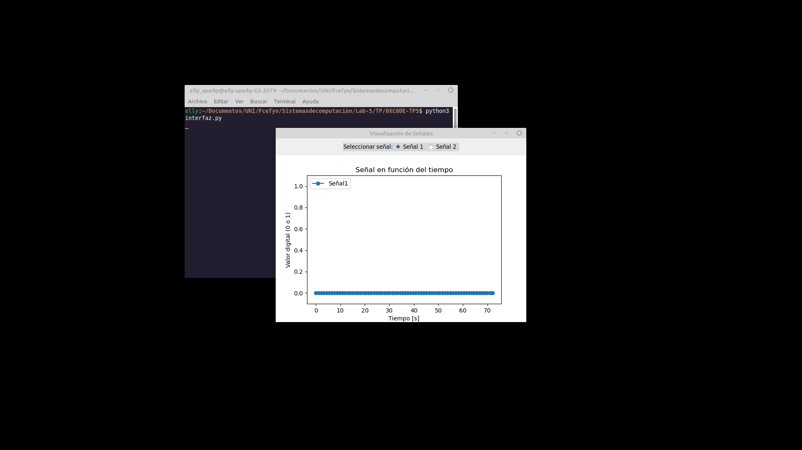
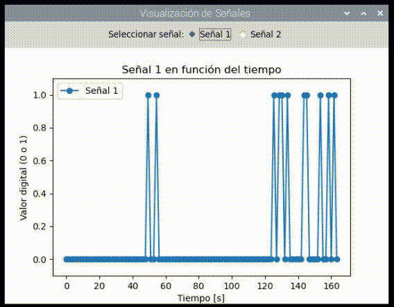

# 0XC0DE-TP5

## Objetivo

El objetivo de este trabajo práctico es desarrollar un controlador de dispositivo (*device driver*) capaz de ejecutarse en una *Raspberry Pi* y leer las entradas de 2 puertos de entrada y salida digital, y desarrollar una aplicación de usuario que utilice el driver para mostrar en pantalla el valor de una de las entradas como una señal cuadrada en el tiempo.

Para realizar este trabajo iniciaremos explicando las bases de como desarrollar un driver, presentaremos una interfaz de usuario en Python con una librería en C++ que permita acceder al driver y finalmente agregaremos las funciones especificas a nuestro driver que permitan leer los puertos digitales.

## Primer driver

Un driver es en un principio unmodulo más como los que ya hemos trabajado en el trabajo anterior, para refrescar se crea con un archivo  .C que contenga una función marcada como *__init* y otra como *__exit*.

Dado que para nuestro ejemplo trabajaremos con un *character device driver* (Apropiado para controladores de dispositivos externos) debemos reservar los números *MAJOR* y *MINOR*, que son identificadores de dispositivos y controladores. Reservaremos número *MAJOR* que represente nuestro controlador y tantos números *MINOR* como dispositivos vayan a hacer uso del controlador (en nuestro caso 1). Para esto se utiliza la función:

```C
   dev_t dev;
   dev_t dev_no;
   int major;
   
   alloc_chrdev_region(&dev_no, BASE_MINOR, MINOR_COUNT, DEVICE_NAME);
   major = MAJOR(dev_no);
   dev = MKDEV(major, 0);
```

La función *alloc_chrdev_region()* reserva dinámicamente un número MAJOR disponible y tantos números MINOR como se indiquen por el valor entero sin signo **MINOR_COUNT**, mientras que **BASE_MINOR** indica cual será el valor base para los números MINOR. Por últimos **DEVICE_NAME** es un _const char*_ que identifica el driver. Hay que tener en cuenta en un caso real que el valor de retorno no debe descartarse ya que este nos indica si ha ocurrido algún error.

Por su parte *dev_no* guarda la información sobre el controlador, luego la macro **MAJOR()** permite recuperar el número MAJOR reservado dinámicamente para el controlador.

Por último con la macro **MKDEV()** se obtiene el identificador para un dispositivo en particular identificado por el número MAJOR reservado y el primer MINOR (asumiendo que BASE_MINOR sea igual a 0).

Ahora para crear el dispositivo necesitamos dos estructuras, la primera es del tipo *cdev*, la cual inicializaremos automáticamente con el uso de la función *cdev_init* y la segunda es del tipo *file_operations*

Para entender esta segunda estructura hay que entender como funcionan los drivers. Como ya se vio cada dispositivo está reconocido por un valor *MAJOR* y otro *MINOR*, pero este identificador es generado dinámicamente, por lo que no se puede esperar que una aplicación de usuario conozca estos valores de antemano, en su lugar lo que se hace es crear un archivo en el directorio */dev* asociado a este dispositivo. De este modo el programa puede conocer el nombre del archivo y comunicarse con el dispositivo a través del mismo utilizando las operaciones típicas de control de archivos (open, read, write, close, etc). Pero para que el dispositivo sepa como reaccionar a cada una de estas operaciones debemos crear funciones que le indique el comportamiento a seguir. La estructura *file_operations* contiene las direcciones de las funciones que deben ejecutarse por el dispositivo al ser accedidos por un usuario a través del archivo de dispositivo.

```C
static struct file_operations dev_fops =
{
    .owner = THIS_MODULE,
    .open = my_open,
    .release = my_close,
    .read = my_read,
    .write = my_write
};
```

En nuestro caso para simplificar el problema haremos que la función de escritura asigne el valor de una bandera como 0 o 1 y la función de lectura retorne el valor actual de la bandera. Debe tenerse en cuenta que los valores enviados por el usuario al escribir serán representados como un buffer de caracteres y el valor que debemos retornar cuando lee también será de este tipo.

```C
static char curr_signal = '0';

static ssize_t my_read(struct file *f, char __user *buf, size_t len, loff_t *off)
{
    char kbuf[1];

    kbuf[0] = curr_signal;

    if (copy_to_user(buf, kbuf, 1))
        return -EINVAL;

    return 1;
}

static ssize_t my_write(struct file *f, const char __user *buf, size_t len, loff_t *off)
{
    char kbuf;

    if (len != 1)
        return -EINVAL;

    if (copy_from_user(&kbuf, buf, 1))
        return -EFAULT;

    if (kbuf != '0' && kbuf != '1')
    {
        return -EINVAL;
    }
    curr_signal = kbuf;
    return len;
}
```

Ahora sí, para crear el dispositivo utilizamos la estructura *cdev* y la función *cdev_add()*.

```
   cdev_init(&c_dev, &dev_fops);
   cdev_add(&c_dev, dev, COUNT);
```

Donde **COUNT** es el número de números MINOR consecutivos que se corresponden al dispositivo, en nuestro caso 1.

A continuación se utiliza otra estructura del tipo *class*. Esta permite obtener una vista de alto nivel del dispositivo, abstrayéndose de como el dispositivo funciona o como se conecta y centrándose en que es lo que hacen. Con esta estructura podemos llamar a la función *device_create()* para finalmente crear el dispositivo. 

```
   cl = class_create(THIS_MODULE, CLASS_NAME);
   device_create(cl, NULL, dev, NULL, DEVICE_NAME);
```

En cuanto a *device_create()* su función incluye registrar el dispositivo en *sysfs* asociado a la clase en particular (*cl*) y generar el archivo */dev* asociado al identificador MAJOR MINOR guardado en *dev*.

Por último debemos declarar nuestra función *__exit* para poder remover el módulo, en esta función debemos destruir el dispositivo, liberar la memoria de las estructuras *class* y *cdev* y liberar la región reservada para los números MAJOR y MINOR.

```C
   static void __exit oxcode_exit(void)
   {
      device_destroy(cl, dev);
      class_destroy(cl);
      cdev_del(&c_dev);
      unregister_chrdev_region(dev, 1);
   }
```

Finalmente compilamos el código y cargamos el driver con *insmod*.

## Acceso al driver

Para podes acceder al dispositivo generamos una librería en C++ que acceda al archivo en */dev*, por cuestiones de compatibilidad con la aplicación en Python debemos declarar las funciones como *extern "C"* pero podemos seguir haciendo uso de comodidades de C++ como los *std::string*. La librería además de leer y escribir sobre el archivo deberá realizar una traducción de los valores string retornados por read a un valor entero que la aplicación de usuario pueda graficar.

```
   bool switch_signal(const uint signal_no)
   {
      if (device < 0  || signal_no > 1)
      {
         return false;
      }
      const std::string value = std::to_string(signal_no);
      const auto ret = write(device, value.c_str(), 1);
      return ret >= 0;
   }

   int read_signal_values()
   {
      if (device < 0)
      {
         return false;
      }
      char buffer[1];

      if (read(device, buffer, 1) <= 0)
         return -1;
      return buffer[0] - '0';
   }
```

Luego el script de Python simplemente accede a la librería para obtener nuevos valores de la señal cada 1 segundo y permite cambiar la señal que se observa con inputs de usuario.



Ahora podemos actualizar el driver para leer valores reales de I/O sin necesidad de actualizar el script de Python ni la librería en C++.

## Driver con GPIO

Para acceder a los puertos de gpio de la raspberry utiliamos el header *linux/gpio/consumer.h*, y específicamente las funciones:

- gpio_to_desc(): Permite convertir de un número de puerto gpio legacy a un descriptor utilizado por las librerías modernas de gpio. En el caso de nuestra placa el puerto se representa como su número más 512 (Por ejemplo el puerto 17 se representa como 529).
- gpiod_direction_input(): Permite setear un puerto de gpio como entrada.
- gpiod_get_value(): Lee el valor de un puerto de gpio.
- gpiod_put(): libera un puerto de gpio.

Las primeras 2 funciones se utilizan en la conficutación de la función __init, la segunda en el read() y la tercera en __exit. Así logramos crear un driver que lee los valores de 2 puertos de gpio siendo totalmente compatible con la librería que escribimos inicialmente, por lo que para testear su funcionalidad solo hace falta cargar el nuevo driver y ejecutar el mismo script de python que usamos previamente.



## Fuentes

- [Manual pages](https://manpages.debian.org/testing/linux-manual-4.8/index.html)
- [Source code class.h](https://elixir.bootlin.com/linux/v6.14.3/source/include/linux/device/class.h#L226)
- [Source code consumer.h](https://elixir.bootlin.com/linux/v6.13.7/source/include/linux/gpio/consumer.h)


